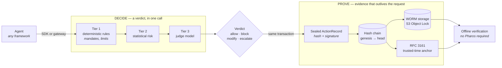

# Pharos

**Real-time policy verdicts for AI agents, with cryptographic evidence of every decision.**

*Pharos decides. Pharos proves.*

[](LICENSE)
[](https://github.com/Bobcatsfan33/Pharos/actions/workflows/ci.yml)

---

When an AI agent is about to do something consequential — move money, send PHI, change a
record — Pharos answers two questions in one call. **Can it?** A policy verdict (allow,
block, modify, escalate) citing the specific rule clause it relied on. **What happened?** A
signed, hash-chained evidence record binding that action to its mandate, its verdict, and
its blast radius — written to WORM storage and verifiable by anyone, offline, later.

One pipeline, two outputs, and that is the whole point: **an agent action can never be
governed without being recorded, or recorded without its governing context.**

**Who it's for.** Teams putting agents somewhere consequential — payments, healthcare,
regulated workflows — who will need to answer *"why did the agent do that?"* months later,
to someone who will not simply take your word for it.

**Why it's different.** Guardrail libraries block bad output but leave no durable trail.
Governance tooling documents policy but never touches runtime. Pharos closes the loop: the
same event that *decides* is the one that *proves*, signed once and chained once.



## Quickstart

A governed action and a verified evidence chain, locally. No cloud account, no API key, no
paid service.

```bash
git clone https://github.com/Bobcatsfan33/Pharos.git && cd Pharos
pnpm install
cp .env.example .env
pnpm infra:up          # Postgres + Redis + MinIO (S3 WORM) via docker compose
```

Govern three agent actions and seal them:

```bash
pnpm demo:durability
```

```
=== Submitting 3 demo actions for tenant "demo-tenant" ===
  seq 0  email.send          -> ALLOW      hash 7928edf0c664…
  seq 1  payment.transfer    -> BLOCK      hash 858d1aae0430…
  seq 2  crm.update          -> ALLOW      hash 7d3ac5477574…

Chain head: sequence 2 hash 7d3ac54775745ded…
```

That `payment.transfer -> BLOCK` is a Tier-1 deterministic rule: the action exceeded its
mandate's limit. The verdict and the sealed record came out of the same transaction.

Now prove the evidence survived a restart and the chain is intact genesis-to-head:

```bash
pnpm demo:durability --verify
```

```
=== Cold verification for tenant "demo-tenant" (simulated restart) ===
Found 3 persisted records after restart.
Genesis-to-head chain verification: PASS ✅
  records checked: 3
```

**Measured on a clean checkout** (2026-08-02, warm pnpm store, Docker images already
pulled): `pnpm install` 2s · `infra:up` 1s · demo 2s · verify 1s. Budget about five
minutes for a genuinely first run — almost all of it Docker pulling the Postgres, Redis and
MinIO images; the commands themselves take seconds.

> **If `--verify` reports a chain break**, you are pointing a fresh checkout at a database
> seeded by a different one. That is correct behaviour rather than a bug — the earlier
> records were signed by a keystore that no longer exists, so their signatures no longer
> verify. Start from a clean database, or remove `.pharos-keystore` and re-run.

Then verify a bundle with **no Pharos infrastructure at all** —
see **[offline verification](docs/external-verification.md)**.

## Use it from your agent

```typescript
import { PharosClient } from "@getpharos/sdk";

const pharos = new PharosClient({ baseUrl, apiKey });

const { verdict, record } = await pharos.submit({
  tenantId: "acme",
  action: { type: "payment.transfer", agentId: "treasury-bot", payload: { amount: 30_000 } },
  liability: {
    mandate: null,
    oversightMode: "autonomous",
    blastRadius: { financialAmount: 30_000, currency: "USD", reversibility: "irreversible" },
    modelMetadata: null,
  },
});

if (verdict.decision === "block") throw new Error(verdict.ruleCitations[0]?.description);
// record.seal.contentHash is now permanent, signed evidence.
```

```python
from pharos_sdk import PharosClient

pharos = PharosClient(base_url=base_url, api_key=api_key)

result = pharos.submit(
    tenantId="acme",
    action={"type": "payment.transfer", "agentId": "treasury-bot",
            "payload": {"amount": 30000}},
    liability={"mandate": None, "oversightMode": "autonomous",
               "blastRadius": {"financialAmount": 30000, "currency": "USD",
                               "reversibility": "irreversible"},
               "modelMetadata": None},
)

if result["verdict"]["decision"] == "block":
    raise RuntimeError(result["verdict"]["ruleCitations"][0]["description"])
```

Both SDKs are deadline-aware, retry transient failures, and apply a **local fail-mode** when
Pharos is unreachable: reversible work fails open, irreversible work fails closed. Framework
middlewares (LangChain/LangGraph, OpenAI Agents, Anthropic SDK, CrewAI, MS Agent Framework)
share one conformance contract, and a zero-code HTTP gateway governs agents that import
nothing at all. See **[docs/sdks-and-integration.md](docs/sdks-and-integration.md)**.

## Status — what is and isn't proven

Pharos is **not a finished product, and its own readiness manifest says so.** That manifest
is machine-checked in CI and currently reads `decision: not-approved` with 6 open blocking
gates. It ships published rather than hidden, because a system whose pitch is *evidence*
should be willing to be evidence about itself.

| | |
|---|---|
| **Works today, tested** | Verdict cascade · sealing · hash chain · WORM · offline verification · TS + Python SDKs · framework middlewares · zero-code gateway · mandates · escalation and review ops · policy lifecycle · redaction · claims packs |
| **Test suite** | 472 TypeScript tests across 68 files, plus 28 Python — run against **real** Postgres / Redis / MinIO. CI fails the build if integration tests are skipped rather than run |
| **Not production-approved** | [`docs/enterprise-readiness.json`](docs/enterprise-readiness.json) · [`docs/procurement-readiness.md`](docs/procurement-readiness.md) |
| **Every known gap** | [`docs/LIMITATIONS.md`](docs/LIMITATIONS.md) |

**On the judges, plainly.** The Tier-3 judges on the default local path are **linear
bag-of-words classifiers**. They are the honest demo path — fast, deterministic, easy to
reason about, and defeated by paraphrase. The transformer judges are wired and served but
remain **restricted pre-production**: their
[model cards](docs/model-cards/production-judges.md) list the adversarial-efficacy,
calibration, and independent-validation evidence still missing. **No judge is promoted or
marketed as production-ready.** The deterministic Tier 1 and statistical Tier 2 carry the
load a demo actually exercises.

**On latency.** The published p99 3.7 ms / ~5,400 verdicts-per-second figure was measured
with the **linear** judges and is **not** a transformer production claim; the
production-topology re-benchmark is open. See
[`docs/benchmarks/latency.md`](docs/benchmarks/latency.md).

## How it's built

| | |
|---|---|
| Operational state | Postgres — policies, mandates, queues, tenants; RLS-isolated under a `NOBYPASSRLS` role |
| Evidence chain | WORM object storage (S3 Object Lock), hash-chained and continuously verified |
| Verdict cache | Redis, deadline-bound |
| Signing | Pluggable `SigningProvider` — local Ed25519 for development, AWS KMS P-256 for production, with rotation and chain continuity |
| Deployment | Docker Compose or Helm — see [deploy/INSTALL.md](deploy/INSTALL.md) |

```
packages/core        ActionRecord schema, hashing, sealing, chain verify, KMS signing
packages/cascade     the tiered verdict engine
packages/storage     Postgres + S3 WORM + Redis; the transactional write path
packages/sdk-ts      TypeScript SDK          sdks/python   Python SDK
packages/middleware  framework adapters
services/api         Fastify ingestion API   services/gateway  zero-code egress gateway
apps/console         Next.js console
```

## Docs

| | |
|---|---|
| [Architecture](docs/architecture.md) | How the pieces fit together |
| [Decision cascade](docs/decision-cascade.md) | Tiers, deadlines, fail-modes |
| [Evidence & sealing](docs/evidence-seal.md) | Chain, anchoring, redaction, claims packs |
| [Offline verification](docs/external-verification.md) | Verify a bundle with no Pharos infrastructure |
| [Schema](docs/schema-v1.md) | The `ActionRecord` event |
| [Threat model](docs/security/THREAT_MODEL.md) | STRIDE analysis and the accepted-risk register |
| [Limitations](docs/LIMITATIONS.md) | Everything that does not yet work as a buyer would want |
| [Sprint history](docs/status.md) | What was built, sprint by sprint |
| [Contributing](CONTRIBUTING.md) | Setup, the review bar, and how this repo is run |

## Contributing

Good first issues are labelled and scoped with acceptance criteria. The house rules — DCO
sign-off, a changeset for publishable packages, integration tests that **run** rather than
skip, and rendering configuration rather than reading it — are in
**[CONTRIBUTING.md](CONTRIBUTING.md)**. Apache-2.0; the
[open-core boundary](docs/adr/0001-open-core-boundary.md) is a proposal that relicenses
nothing. Be decent — see the [Code of Conduct](CODE_OF_CONDUCT.md).

---

*Pharos decides. Pharos proves.*
